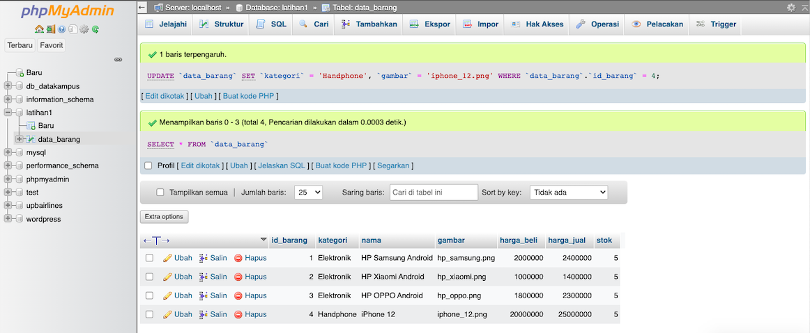
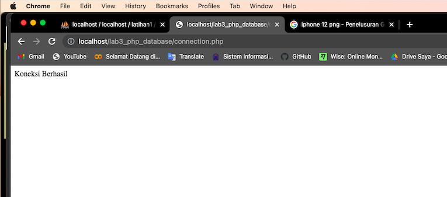
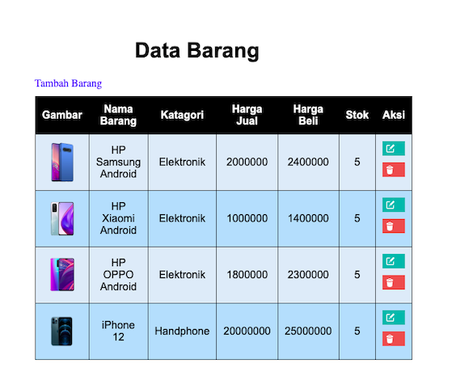
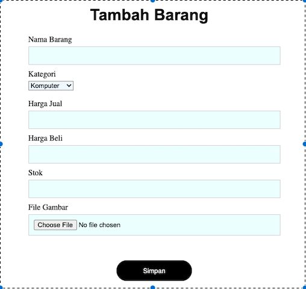

# Berikut adalah program file PHP dengan DATABASE (CRUD)

### Dibawah ini adalah screenshot untuk database yang telah dibuat dengan nama database latihan1 dan nama tabel adalah data_barang:

### Dibawah ini adalah screenshot untuk file connection.php untuk menghubungkan file php dengan database yang kita punya:

### Dibawah ini adalah screenshot untuk file index.php:

### Dibawah ini adalah screenshot untuk file tambah.php, yaitu fungsi untuk menambahkan data kedalam database:

## Sekian untuk praktikum Lab 3 PHP dengan Database ini